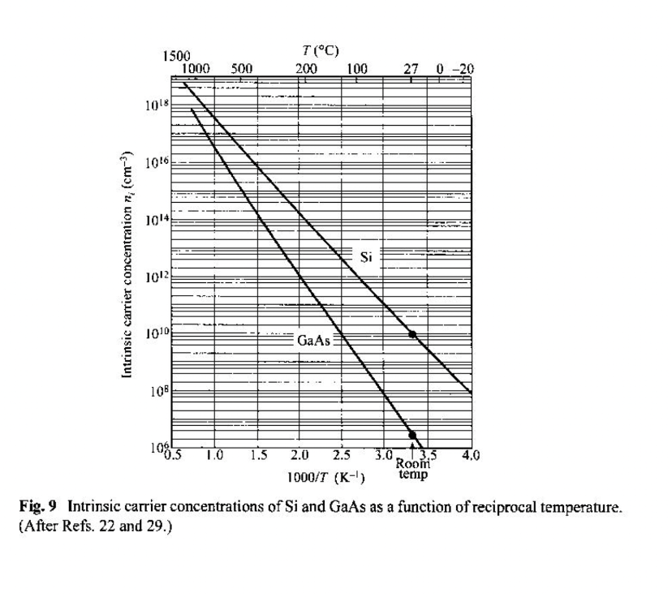
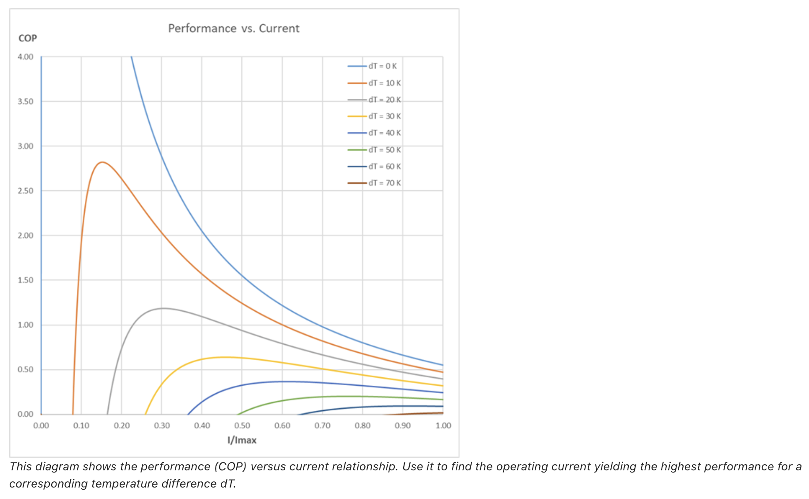

# Overview

This program attempts to characterize a simple Peltier device with a simplified Silicon semiconductor design, parabolic band simplification. The characterize comes mostly from emergent properties through boson-einstein (BE) statistics for the phonons and through fermi-dirac (FD) statistics for the electrons--which are fermions.

The program then attempts to calculate a ZT merit for the material and a COP for the operation over a given temperature range by the client code.

## Predictive data from the program comparison to real data

The lower level properties, such as carrier density and Debye temperature at various temperature for Silicon are the best showing of the programs predictive behavior because they are least effected by the parabolic band simplification of silicon, which has a rising error rate as level of abstraction increases, generally. Some other measurements will also be provided for a quick analysis and overall trends for more abstracted values will be provided.

First, a quick discussion of the parabolic band simplification and what it entails. Parabolic band simply refers to the shape of the band structure between the conduction band--the band where electrons move freely, and valence band--the band whee electrons are static. The structure between these bands has impacts on how electrons travel which impacts the density of states (DOS), thermal conductivity, emission and absorption rate, chemical potential, and effectively all thermal properties--including ZT merit and COP.

Here is a nice ascii visualization of the band structure I am describing:

This is the band structure of silicon along high-symmetry directions. As you can see the structure follows a sort of M shape. Therefore, the parabolic band simplification is not the worse at low energy levels. But as energy levels increase, i.e more heat is added to the system exciting more electrons to jump the gap from valence to conduction band, the band structure has different minima and fails more and more to be parabolic. This is the main reason why values differ.

Here are some values:

### Carrier Density

The carrier density provided by the program at room temperature, 300K, is 7.18e+15 carriers/cm^-3.

This table is taken out of Physics of Semiconductor devices 3rd edition by S.M. Sze and Kwok K. NG and can be found on [page 20](https://archive.org/details/PhysicsOfSemiconductorDevices_855/page/n27/mode/2up).

At room temperatures it shows the carrier concentration, which is the same thing as density, in cm^-3 to be about 10^10 for silicon. These values might seem very different, and they are, but this is a product of the parabolic simplification for silicon. It might also be that this model used for the provided graph is assuming nondegenerate where my model is life and therefore dynamic in how degenerate it is, bordering to nondegenerate though.

More importantly, the trend of this graph shows that as temperature decreases, carrier density also decreases which is depicted in my program as so:

At T = 500K: carrier density: 3.02e+27 cm^-3
At T = 400K: carrier density: 1.46e+30 cm^3
At T = 300K: carrier density: 7.18e+15 cm^-3
At T = 200K: carrier density: 3.70e+10 cm^-3
At T = 100K: carrier density: 4.27e-05 cm^-3

The slight jump at 400K and dip at 500K is most likely due to un accounted for numerical stability and the parabolic simplification failing at high energy levels. But overall the trend holds true.

It is also evident that carrier density over time is logarithmic, as seen from the linear line on a logarithmically scaled graph from the textbook. This trend is followed by my graph of carrier density over temperature as well, before it beak just above room temperature, again most likely because of the parabolic simplification.

### COP

The COP of a Peltier device can be though of as COP = Q_c/P_in whee Q_c is the heat absorbed at the cold side--cooling power--and P_in is the electrical power input. Its effectively a measurements of heat pumping capacity to electrical power input. This serves as a decent qualatative way to examine COP of a Peltier device, in reality because of joule heating and complex band structures and thermodynamics near junctions, COP is not so easy to quantitatively define. A better way to think og it is as a ratio of the (sqrt(1+ ZT_avg)-1)/(sqrt(1+ZT_avg)+T_C/T_H) ZT_avg is heavily tied to material properties, being a direct dimensionless figure that can tell one about the band structure.

This graph shows the COP at difference differences in temperatures for different wattages. At dT of 20, the COP caps out at a bit above 1.0 for the COP, which is similar to what my program provides.

### Other values

Other values like emission and absorption rates and thermal conductivity also follow correct trends but have more incorrect numbers.

Do note that all the provided values are not making the parabolic band assumption.

## Conclusion

The value of this program is mostly pedagogical. It shows how to build up a simple Peltier system from the ground up and comments it in detail and provides final values for everything that are somewhat close to real values, as shown the data analysis. This can be helpful for learning and understanding statistical thermodynamics in condensed matter physics to an elementary degree. As stated, the parabolic band simplification is the single greatest detriment to this system. The system can do decently at low energy levels, but as temperature evolves numbers get sporadic and do not serve as predictive measures.
